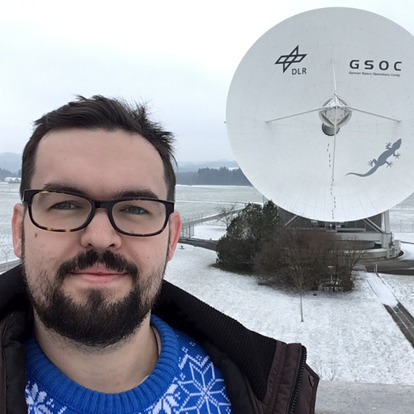
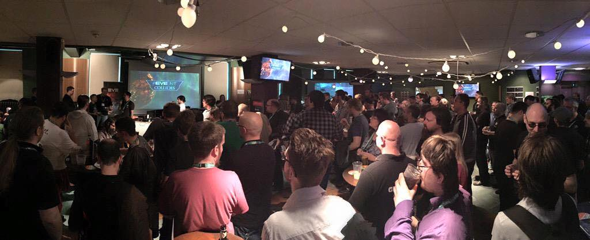
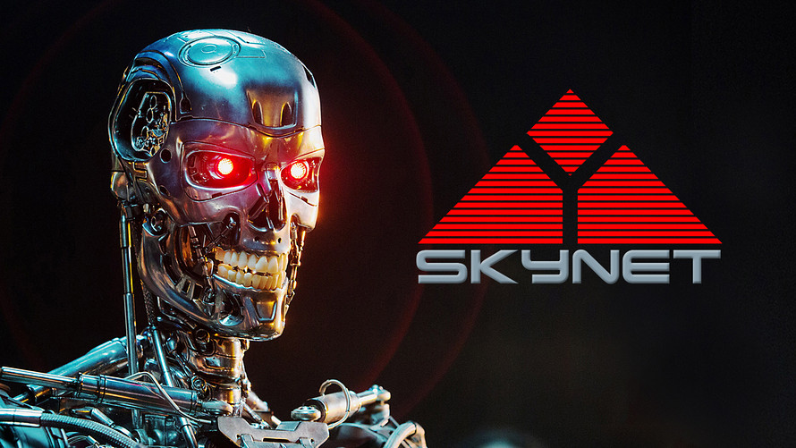

# From Aerospace to Gaming: An Exclusive Interview with a Producer at CCP Games

## Who is Scott McCabe
I recently had the chance to sit down with the incredibly talented producer Scott McCabe at CCP Games. With an impressive background in the aerospace industry spanning over a decade, Scott has a knack for tackling complex problems, adapting to challenging situations, and consistently delivering high-quality projects, even when faced with tight deadlines.

But Scott is not just all work and no play. As a passionate Systems Engineer who made the leap from aerospace to gaming, he brings a unique perspective to his role at CCP Games. His love for gaming, combined with his unrivaled ability to organize events and have fun, makes Scott an exceptional figure in the industry.

So, without further ado, let's dive into our conversation and explore Scott's fascinating journey, experiences, and insights across the aerospace and gaming worlds.

## How has your experience in the aerospace industry shaped your approach to producing video games at CCP Games?
Transitioning from a highly technical industry with strict engineering processes and methodologies into the comparatively chaotic software development industry was quite a change. In space, you encounter extremely rigid scenarios, where testing is critical, and if you miss a launch, you're paying the rocket company anyway (unless you're spending $100 million on your own private launch).

My experience in aerospace taught me a lot about planning, working within technical and business constraints, and how to prioritize and make efficient trade-offs. I bring much of that workflow into my producer role at CCP.

## What similarities and differences do you see between the challenges faced in the aerospace industry and those in the video game industry?
One thing that I see a lot in both space and gaming is a certain level of churn due to both industries being considered 'dream job' level for many people. This means that there's almost always more people wanting those jobs than there are jobs available, which can depress and undervalue individual compensation levels. It's very common for game development software jobs to pay less than, say, banking software developers. I've been fortunate to work for companies that value individual contributors, but it's definitely an issue.

Another challenge is gender equality. STEM subjects in general are quite male-dominated. Many tech companies recognize this and contribute to STEM programs in schools to encourage young women into more tech-focused career paths at an earlier age, which is a positive development.

On the bright side, people in these industries are passionate. For me, being excited about the products and projects I work on is extremely important. I couldn't imagine working on something I don't enjoy or believe in, even if it paid me a lot more.

## As a long-time EVE Online player and community event organizer, how has your passion for the game evolved since joining CCP Games as a producer?

EVE Online has had a significant impact on my personal and professional life. Being part of the team that helps further the game for others gives me great satisfaction. Seeing that passion reflected in many of my colleagues is fantastic and can be infectious at times.

## Can you tell us a fun story from one of the EVE_NT events that you’ve organized or hosted?

At one of the EVE_NT meets we ran in Nottingham, UK, we were always looking for more ways to improve the meets and decided to take a page directly from Fanfest by organizing our own pub crawl. It took place on Friday (the day before the main meet) and we had groups, leaders, mascots, etc. By all accounts, it was a fantastic pub crawl with EVE nerds enjoying themselves, visiting great local bars, and culminating in all groups converging on a single larger venue at the end of the crawl for a bit of a party. It was a wonderful evening.

Unfortunately, the next day at the main meetup, everyone was so hungover that the energy level was lower, and the bar took only 25% of the normal event revenue. The venue wasn't pleased, as we got the space for free due to connections, and they covered their staffing costs and regular fees from the bar revenue. We never ran a pub crawl again.

## As a Senior Space System Engineer at D-Orbit, you were involved in some groundbreaking projects. Can you share with us one of the most exciting challenges you faced while working on these projects, and how it might relate to the gaming world?

I was involved in repositioning a satellite from approximately 6 degrees east to around 95 degrees east. This is over the horizon from the UK ground stations, so we had to design and build a smaller remote station in Australia. We built it inside a shipping container, tested and verified it in the UK, and took control of the satellite with it. We then started the drift maneuver, which was about 3 degrees per day and was due to take approximately 3 months to reach the new position. For about half of that time, we could still see the satellite from UK ground stations before it went over the horizon. We then had 45 days to dismantle the station, ship it to Australia, fly out after it, and set it up again. 

As part of that process, we had a backhaul link via terrestrial networks to the UK sites due in 12 days before the satellite would go over the horizon, but the suppliers failed and announced a 3-month delay. We had 12 days to figure something out, or we'd have to burn fuel to stop the drift and use even more fuel to restart it. We managed to build, test, and bring online a system for bouncing the signal off another one of our satellites at around 53 degrees east that could be seen from both sites with about 2 days to spare. It was so borderline that we even had to cut down trees, as the 53 degrees east satellite was only a few degrees above the horizon in Australia.

This project involved problem-solving, fast execution, constrained resources, time pressure, stakeholder management, technical engineering work, creativity, and implementation challenges. All these factors are highly relevant in many industries, including game development.

## Considering your work on the Skynet 5 system and the rapid progress of AI technology, do you think we’re getting closer to a “Terminator’s Skynet” scenario? What are your thoughts on AI in the gaming industry?

AI is a tool to be used for various purposes. Rapid prototyping, idea refinement, and other applications are all useful. I'm more excited to see what AI can do within games in the future.

## What has your experience been like moving to Iceland to work at CCP Games? Have you encountered any major culture shocks or unique experiences?

I'm fortunate that I've spent a considerable amount of time in Iceland over the years, so I was prepared for most of the cultural differences. I am endlessly impressed that Icelandic wind always manages to blow in your face, regardless of which direction you move in.

## Did you ever envision yourself working in the gaming industry, or was it your passion for EVE Online that led you to working at CCP Games?

I wanted to work in game development when I was younger and always enjoyed tinkering and creating my own small projects. Space was my other passion growing up, and at university, I became more drawn to hardware and systems engineering than software engineering. I continued to have a passion for both over the years (and still do).

If I hadn't been as involved with EVE Online over the years, though, I highly doubt I would have ended up working in games, so I certainly credit that passion directly for leading me here.

## As someone who has had a successful career in both the aerospace and gaming industries, do you have any advice for young people starting their careers in STEM fields?

Pursue what makes you happy, and don't be afraid to change your path as you change as a person.

Create your own opportunities. I ended up in many situations and positions because I directly sought them out. This included calling the person who would be my boss in the space industry for many of my early years and essentially saying, 'I enjoyed working a lot with you and your team for the last 2-3 months (I was supporting a project that had ended). The work is interesting, and I really like what you're building. Can I come work for you?'

Protect your work-life balance. Make sure you retain evenings, switch off at times, go on vacation, etc. Don't burn out trying to accomplish everything at once. It's okay to take a breath sometimes and enjoy life.

