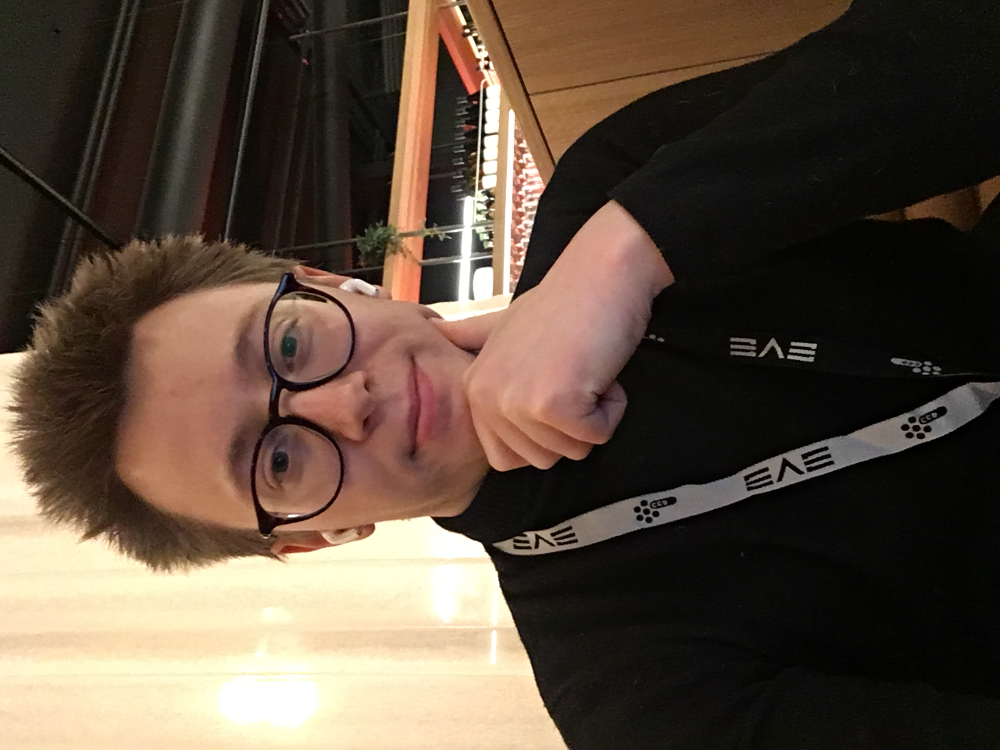
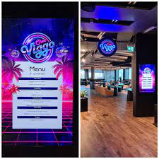
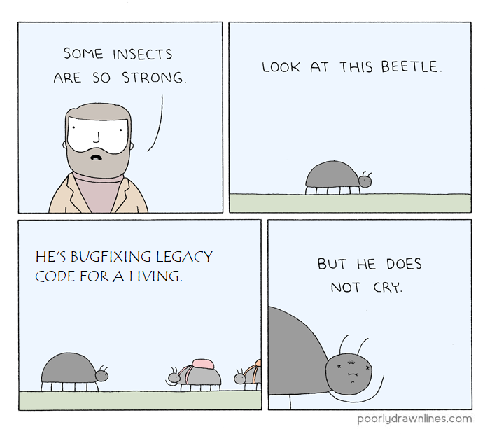

# Reynsla mín af starfsnámi hjá CCP Games

## Umsóknin
Alveg frá því snemma á síðustu önn var ég staðráðinn í að fara í starfsnám, þar sem ég hafði heyrt góða hluti um það frá vini mínum sem var í starfsnámi samhliða Hugbúnaðarverkefni 2 árinu áður.

Ég beið þangað til ég sá auglýsingu um að búið væri að opna fyrir umsóknir í 24 eininga starfsnám seint á haustönninni, fann tvær stöður auglýstar hjá CCP Games sem mér leyst vel á og sótti um. 

Skila þurfti inn ferilskrá og kynningarbréfi eins og almennt er þegar sótt er um vinnu hjá slíkum fyrirtækjum, en einnig þurfti að fylgja með afrit af einkunnaskjali sem ég fékk hjá Háskólanum. Einnig þurfti að uppfylla ákveðnar lágmarks námskröfur um að vera með 7.25 meðaleinkunn í námsferlinum og að vera búinn að ljúka ákveðnum fjölda eininga.

## Umsóknarferlið

Stuttu síðar var ég boðaður í skimunar viðtal hjá fulltrúa mannauðsdeildar CCP Games, og svo stuttu eftir það fékk ég viðtal með tveimur meðlimum teymisins sem hafði áhuga á að ráða mig.

Viðtölin sjálf voru mjög óformleg og þæginleg, engin próf eða slíkt eins og í venjulegu umsóknarferli. Að mörgu leiti stýrði ég sjálfur viðtalinu og sagði frá sjálfum mér, afhverju mig langaði að vinna hjá þeim, svaraði ýmsum spurningum, og spurði svo sjálfur út í ýmislegt tengt vinnunni. 

## Hlutverk mitt sem starfsnemi 

Starfsnámið er 6 mánuðir frá byrjun janúar og út júní. 

Sem starfsnemi þá er aðal hlutverk mitt fyrst og fremst að öðlast reynslu og þekkingu í gegnum vinnu umhverfi sem ekki er hægt að læra innan kennslurýmis.

Einnig vinn ég náið með teymi af verkfræðingum og forriturum sem vinna að því að þróa, laga, og viðhalda innanhús tólum fyrirtækisins sem eru notuð við gerð leiksins EVE Online.

Á hverjum degi mæti ég á svokallaðan "stand-up" fund þar sem allir meðlimir teymisins fara fljótlega yfir hvað þeir eru að vinna að og hvernig það gengur. 

Hingað til hafa verkefnin mín verið helst að laga bögga með lága forgangsröð, eða litlar viðbætur til að auka gæði tólanna, til þess að læra inn á tólin og kynnast kóðanum sem liggur að baki þeirra. 

Sem starfsnemi þá hef ég engan settann skilafrest fyrir verkefnin mín, en þó er gert ráð fyrir að mér miði áfram og ég hvattur til að biðja um aðstoð ef mér gengur illa að leysa þau.

## Væntingar og upplifun
Í upphafi starfsnámsins hafði ég í raun mjög litla hugmynd um við hverju var að búast þegar ég byrjaði að vinna. Ég hafði verið ráðinn inn í ákveðið teymi sem var á þeim tímapunkti ekki með neinn tiltækann leiðbeinanda fyrir mig, og því fékk ég að ganga til liðs við tólateymið tímabundið á meðan ég var þjálfaður upp samhliða öðrum starfsnema, hinum frábæra forseta NÖRD, Árna Sörenssen. 

Upplifun mín af Team Gadget, innanhús tólateymi CCP, hefur verið frábær. Allir meðlimir teymisins eru mjög vingjarnlegir, hjálplegir, og faglegir. Mínir nánustu yfirmenn eru mjög sveigjanlegir og kom það mér á óvart hversu sveigjanlegur vinnutíminn er í raun og veru, svo lengi sem maður vinnur vinnuna sína. Þó að mælt var með við okkur að reyna að mæta sem mest á vinnustað þar sem við erum starfsnemar, þá er í boði að vinna að heiman þegar það hentar.

## Kúltúrinn og umhverfið

Eins og ég kom inn á áður, þá er vinnutíminn mjög sveigjanlegur, og ekkert "clock in" kerfi til að fylgjast með hverri mínútu sem maður vinnur. 

Einnig er frábært mötuneyti með besta hádegismat landsins á hverjum degi sem er algjör lúxus. Svo eru ýmsir hópar innan fyrirtækisins sem skipuleggja viðburði, afþreyingu, og hittinga. Til dæmis skráði ég mig í "Fun Division", og svo eru slack-rásir fyrir hina og þessa hluti sem öllum er leyfilegt að taka þátt í. 

Tæknideildin innanhús er skipuð af algjörum snillingum sem hikuðu ekki við að rétta út hjálparhönd þegar lítill vesæll starfsnemi var í vandræðum með vinnutölvuna sína, og strax í annarri viku minni var ég kominn með öflugustu PC tölvu í teyminu mínu. 

Ég var ekki lengi að setja upp tölvuleikinn World of Tanks á nýju vélinni og spila ég stundum einn leik í hádegishléinu til að slappa af.

## Helstu áskoranir

Það erfiðasta hingað til sem mér hefur fundist í vinnunni er að setja mig inn í svona stórann kóðabasa, sem dregur anda sinn aftur 20 ár, skrifaður í Python 2 sem er nú úrelt tungumál, og að skilja annarra manna kóða sem er oft á tíðum ekkert skjalaður. 

Einnig hef ég verið að kynnast útgáfustjórnunarkerfinu Perforce sem er alveg nýtt fyrir mér, og venjast því umhverfi. 

Eitt verkefni sem tók mig lengstan tíma hingað til var tengt því að hægt er að snúa til baka nýjum skrám í Perforce án þess að eyða skránni úr tölvunni. Verkefnið mitt var að finna slíkar langvarandi skrár í tölvunni sem fundust ekki í Perforce skráarkerfinu, og bjóða upp á að eyða þeim eða bæta við aftur í breytilistann í Perforce. Upphaflega leit þetta verkefni ekki út fyrir að vera rosalega flókið, en sökum ýmissa persónukvilla Perforce hugbúnaðarins, mismunandi sniðs skrárslóða, og annarra vandamála sem ég bjóst ekki við þá endaði þetta verkefni að taka mig marga daga að leysa, en í lokinn var ég svo glaður þegar ég skilaði því af mér og fékk samþykki frá teyminu fyrir kóðviðbótina mína. 

## Vaxið í starfi
Sökum reynslu minnar að því að vinna hjá CCP Games þá hefur sjálfstraust mitt sem forritari aukist, ég hef tileinkað mér betri forritunarvenjur, vanist því að nota debuggerinn meira en ekki bara setja prent skipanir út úm allt, og svo hefur starfið fengið mig til að kunna að meta Hubgúnaðarverkfræðina sem hefur undirbúið mig ágætlega fyrir þetta starf. 

## Mitt ráð fyrir þá sem hafa áhuga á að fara í starfsnám
Starfsnámið er hugsað sem 80% hlutfall af venjulegri námsönn, sem samsvarar 4 námskeiðum samtalst 24 einingar. 
Það er mismunandi milli fyrirtækja hvernig skipulaginu á vinnutímanum er háttað í kringum námið, en það er yfirleitt komist að samkomulagi sem hentar nemendanum sem best til að vinnan hafi ekki neikvæð áhrif á námið.

Ef þú ætlar í starfsnám, þá myndi ég íhuga tvö atriði fyrst:
- Eru einhver virkilega spennandi eða mikilvæg námskeið sem þú þyrftir að sleppa til þess að fara í starfsnám, og er það þess virði að fara hálfu ári á undan út á vinnumarkað í stað þess að taka þessi námskeið? 
  -  Þó ég sé ekki eftir því að fara í starfsnám, þar sem ég er á fjórða ári í mínu námi og á aðeins 20 einingar eftir til að ljúka náminu, þá er ekki víst að þetta henti öllum sem eru að taka BS gráðu á hefðbundum þremur árum. 
- Væri álagið af vinnuvikunni of mikið til þess að sinna náminu þínu almennilega?
  - Ég hef upplifað það, sérstaklega fyrstu vikunnar, að nánast öll mín orka gufar upp að loknum vinnudegi, og því hef ég þurft að skipuleggja mig sérstaklega til þess að ná að sinna þeim verkefnum sem ég þarf að skila af mér í skólanum samhliða vinnunni. 

## Lokaorð

Í heildina þá hefur upplifun mín af starfsnámi hjá CCP Games verið frábær. Fyrirtækið er skemmtilegur vinnustaður, það er góður starfsandi, og fullt af tækifærum til þess að vaxa í starfi ef ég fæ fastráðningu þar í framtíðinni. Vinnan hefur vakið áhuga minn á allskonar hlutum innan tölvunarfræðinnar, sér í lagi þróun tölvuleikja, og hlakka ég til horfa aftur um öxl í lok annarinnar og sjá hvað ég hef lært og áorkað miklu. 
